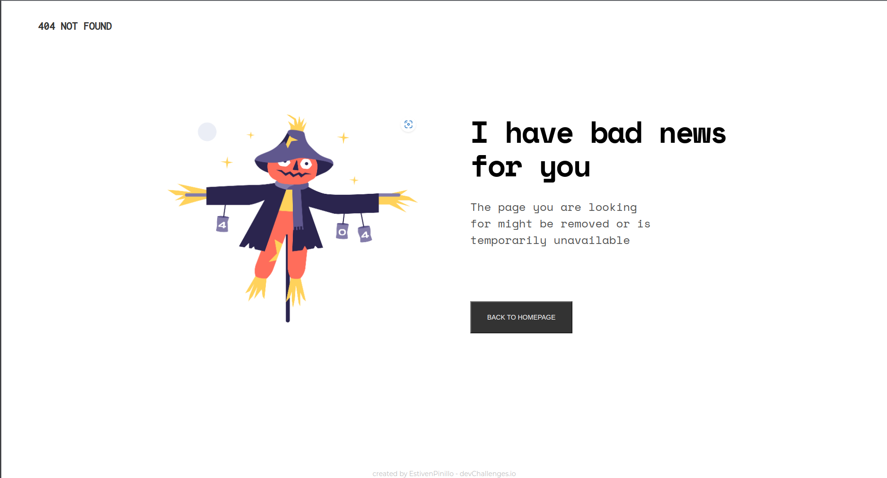
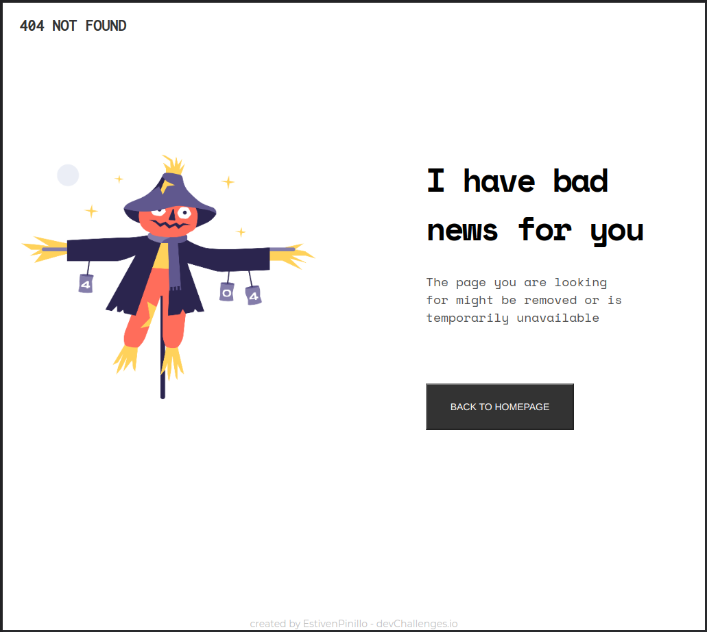
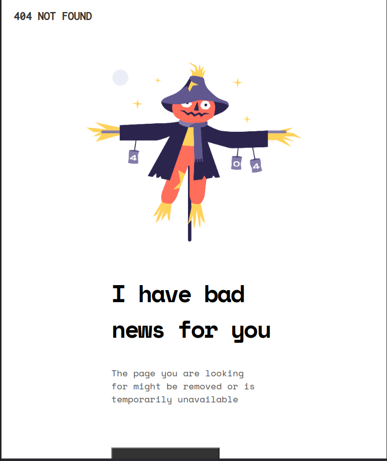
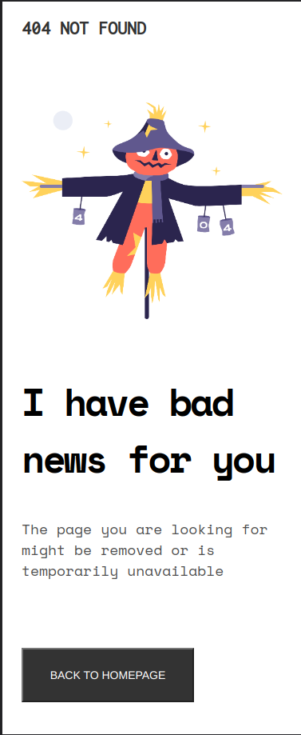

<!-- Please update value in the {}  -->

<h1 align="center">404 not found</h1>

   Solution for a challenge from  <a href="http://devchallenges.io" target="_blank">Devchallenges.io</a>.

  <h3>
     | 
    <a href="https://estivenpinillo.dev/404-not-found-master/index.html" target="_blank">
      Solution
    </a>
     | 
    <a href="https://devchallenges.io/challenges/wBunSb7FPrIepJZAg0sY" target="_blank">
      Challenge
    </a>
  </h3>

<!-- TABLE OF CONTENTS -->

## Table of Contents

- [Overview](#overview)
- [Built With](#built-with)

<!-- OVERVIEW -->

## Overview

Screen 1440

Screen 1024

Screen 768

Screen 375

### Built With

<!-- This section should list any major frameworks that you built your project using. Here are a few examples.-->

- HTML 5
- CSS 3
